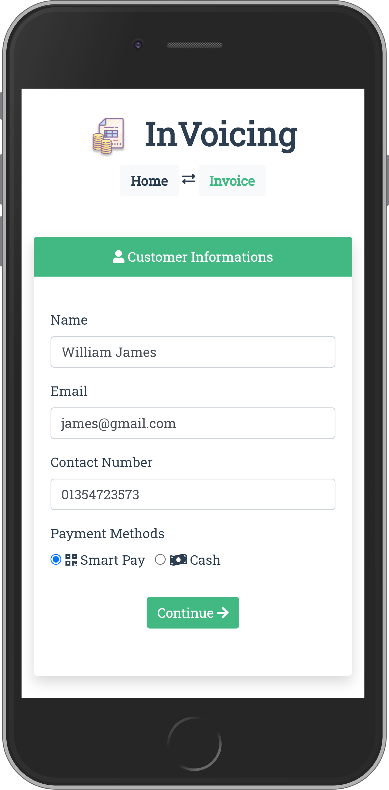
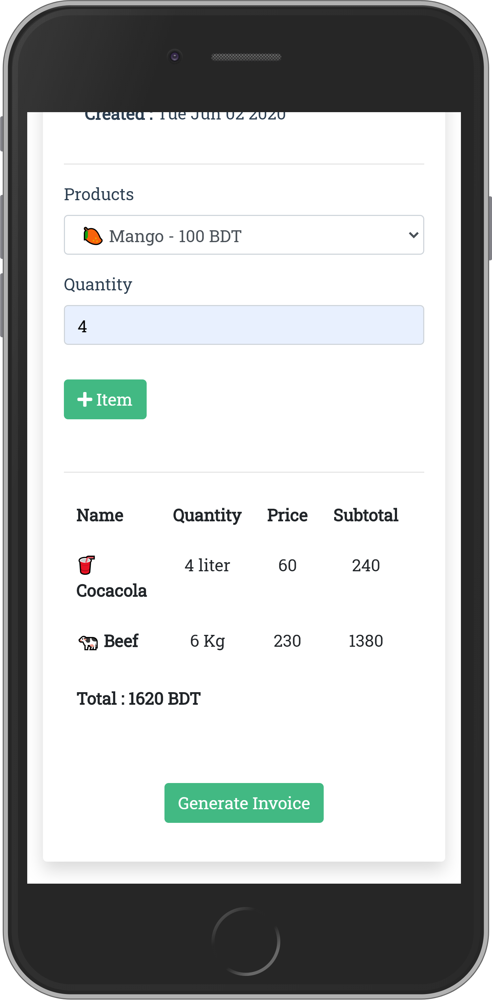
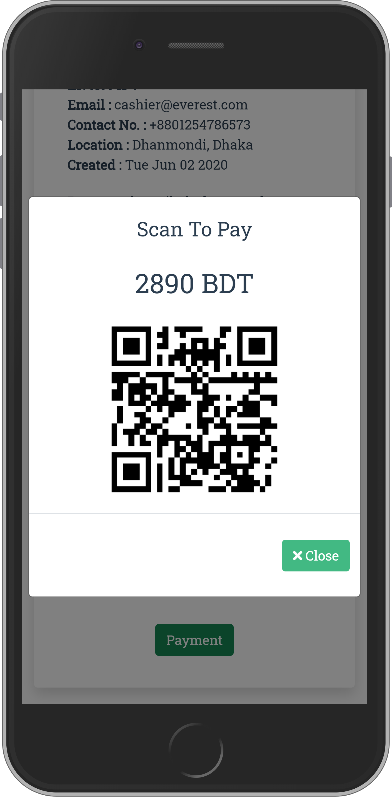

# [](Winter) InVoicing


InVoicing lets you create dynamic invoices for your store. The App will do all the calculation based on the given quantity, price of the product and discount given of all the products in the cart. This also gives your customers a clean view of their purchased items. It also has a scan to pay feature, where you can add your own payment options and let your customers pay through their smart phones easily and if cash method is selected then the app will just show the total amount pay. The Qrcode was generated using  [QR Code Generator's](http://goqr.me/api/) Api.

[](Signup)[](Cart)[](Payment)


 Feel free to use the project as per the [License](LICENSE) given. If you liked the project feel free to give a star.


## Project setup
```
npm install
```

### Compiles and hot-reloads for development
```
npm run serve
```

### Compiles and minifies for production
```
npm run build
```

### Lints and fixes files
```
npm run lint
```

### Customize configuration
See [Configuration Reference](https://cli.vuejs.org/config/).
